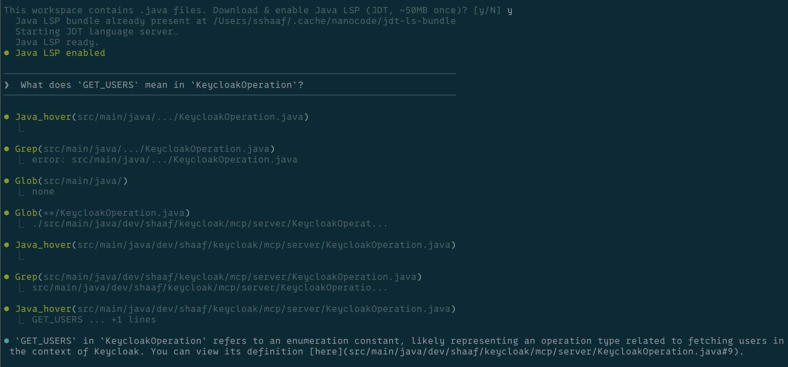

# nanocode

Minimal Claude Code alternative. Single Java file, runnable with [jbang](https://jbang.dev), zero..eh..1 json dependency, ~260 lines.

Built using Claude Code, then used to build itself.



## Features

- Full agentic loop with tool use
- Tools: `read`, `write`, `edit`, `glob`, `grep`, `bash`
- Conversation history
- Colored terminal output

## Usage

```bash
export ANTHROPIC_API_KEY="your-key"
jbang nanocode.java
```

### OpenRouter

Use [OpenRouter](https://openrouter.ai) to access any model:

```bash
export OPENROUTER_API_KEY="your-key"
jbang nanocode.java
```

To use a different model:

```bash
export OPENROUTER_API_KEY="your-key"
export MODEL="openai/gpt-5.2"
jbang nanocode.java
```

## Commands

- `/c` - Clear conversation
- `/q` or `exit` - Quit

## Tools

| Tool | Description |
|------|-------------|
| `read` | Read file with line numbers, offset/limit |
| `write` | Write content to file |
| `edit` | Replace string in file (must be unique) |
| `glob` | Find files by pattern, sorted by mtime |
| `grep` | Search files for regex |
| `bash` | Run shell command |

## Example

```
────────────────────────────────────────
❯ what files are here?
────────────────────────────────────────

⏺ Glob(**/*.java)
  ⎿  nanocode.java

⏺ There's one Java file: nanocode.java
```

## License

MIT
